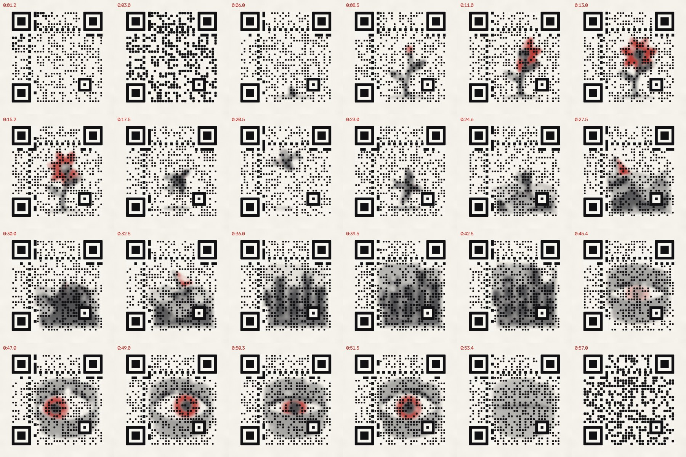

# SCAN ME

A 60-second animated short in an ink-on-paper style where **every frame is a
working QR code**. A seed grows into a red flower, a petal becomes a bird,
the bird dives into the sea, the waves settle into a night city, the moon
becomes an eye that looks straight at you and blinks, and everything
dissolves back into a clean code. Pause anywhere and point a phone at the
screen: you get a message. Scanning in order spells out a hidden sentence one
word at a time, and the last five seconds open a link.

| output (in `scan_me/output/`) | |
|---|---|
| `scan_me.mp4` | 1080x1080, 30 fps, H.264 CRF 12, yuv420p, faststart |
| `scan_me_x_test.mp4` | the same re-encoded at 720x720 CRF 28 (social-media stand-in, testing only) |
| `messages.json` | the payload schedule, QR version and the mask chosen per segment |
| `verification_report.csv` | one row per frame: expected payload, every decoder's result, pass/fail per pass |
| `render_log.csv` | per frame: what the scanner safety net predicted and repaired |

## Quick start

```bash
cd scan_me
pip install -r requirements.txt     # plus system ffmpeg (libx264) and cairo; libzbar0 optional
python render.py                    # ~6 min on 4 cores -> output/scan_me.mp4 (+ x-test copy)
python verify.py                    # ~3 min -> Pass A, B, C and output/verification_report.csv
python -m pytest -q                 # 34 tests
```

Other entry points:

```bash
python render.py --preview                  # every 3rd frame at 540 px, no safety net -> output/preview.mp4
python render.py --frame 420                # one frame -> output/frame_00420.png, with both decoders' reads
python render.py --start 14 --end 24 --preview
python verify.py --passes A --stride 10     # quick partial check
python verify.py --tune                     # smallest DOT_FRACTION that passes everything
```

Everything the viewer sees is set in `config.py`: the sentence, `FINAL_URL`,
title, word hold time, bonus messages, colours and dot sizes. The QR
version, the schedule and the masks are recomputed from it.
Rendering is deterministic (the paper grain is seeded).

## Results



Verification of the final render (`python verify.py`, all 1800 frames):

| pass | what is checked | result |
|---|---|---|
| **A** | lossless frames: zxing-cpp **and** OpenCV must return the exact payload | **1800 / 1800** (zxing 1800, OpenCV 1800) |
| **B** | every frame after each of 7 degradations, zxing-cpp: downscale to 540 px and back, JPEG q40, Gaussian blur 1.5 px, rotation 4°, perspective warp, gamma 0.8, gamma 1.25 | **1800 / 1800** for every degradation |
| **C** | every frame decoded from `scan_me.mp4` and from the 720 px CRF 28 x-test copy, zxing-cpp | **1800 / 1800** on both videos (OpenCV also reads 1800 / 1800 on both) |
| sentence | the word payloads decoded from the main video, read in order | `YOU FOUND THE MESSAGE HIDDEN INSIDE THIS FILM` ✓ |
| link | last frame | `https://example.com` ✓ |
| info | pyzbar (optional third decoder, not required) | 1444 / 1800; its misses are in the dark sea and city acts |

**DOT_FRACTION tuning** (`python verify.py --tune`: every 5th frame, and the
safety net may not enlarge dots, so the value is exactly what is drawn):

| DOT_FRACTION | Pass A | Pass B | Pass C | |
|---|---|---|---|---|
| 0.52 | 318 / 360 | 360 / 360 | 720 / 720 | fail (OpenCV) |
| 0.54 | 346 / 360 | 360 / 360 | 720 / 720 | fail (OpenCV) |
| **0.56** | 360 / 360 | 360 / 360 | 720 / 720 | **smallest that passes** |
| 0.58 | 360 / 360 | 360 / 360 | 720 / 720 | pass |
| 0.60 | 360 / 360 | 360 / 360 | 720 / 720 | pass, **shipped** |

Below 0.56 only OpenCV's clean-frame read fails. In every tuning run
zxing-cpp passed all degraded and video checks at every value tried, down
to 0.46. The film ships at 0.60 on purpose. OpenCV compares each module with
the whole symbol's average white fraction, so slightly bolder dots on paper
let the light modules inside the ink keep their margin. On sampled frames
that cuts the ink the safety net lifts out of the picture by about a third.
At 0.56 the net also ends up enlarging about 23 dots per frame. Set
`DOT_FRACTION = 0.56` in `config.py` to ship the minimum.

**Safety net on the final render** (`render_log.csv`): 1273 of 1800 frames
needed some repair. Usually that is a partial lift of ink around 10–25
modules, faded in and out over 6 frames. Dot enlargement was needed in only
33 frames. After repairs, the worst Reed–Solomon block of any frame is
predicted to hold 2 (OpenCV) / 3 (zxing) wrong codewords, of the 8 that
level H corrects.

Timing on 4 cores: mask selection 71 s, repair maps 148 s, frames 124 s,
verification 163 s. At CRF 12 the main video is 9.4 MB (~1.25 Mb/s). The
content is flat paper, dots and soft washes, so that is near-lossless.

## How a frame is built

Three layers, bottom to top (`compose.py`):

1. **Paper**: `#F4F1EA` with a static, seeded grain of about 1 grey level.
2. **Picture**: the scene for this frame (`scenes.py`, one procedural
   `draw_scene_X(ink, red, t)` per act, pycairo paths and eased motion) as
   ink and accent densities. It is drawn as an ink wash: softened, capped in
   darkness, and faded out near the quiet zone and the light function modules.
3. **Code**: a rounded-square dot at the centre of every data module in its
   true colour (`#111114` / `#F7F5EF`). Finder, alignment, timing and format
   modules are drawn full and solid on top; only the finders' outer corners
   are slightly rounded.

One fixed version for the whole film: the smallest that fits the longest
payload at level H. That is **version 4** (33x33 modules, 26 px each) for
the default text; a longer `FINAL_URL` moves it up automatically. Within a
payload segment the modules never change and only the picture moves. At a
segment boundary all dots switch on one frame, and that switch is the
film's heartbeat shimmer.

### What the two reference decoders taught the design

The two required decoders read a module in very different ways, and that
shaped everything else:

* **zxing-cpp** compares the *centre pixel* of each module with a local
  `(max+min)/2` threshold. A small centre dot is enough for it.
* **OpenCV `QRCodeDetector`** binarises with a Gaussian adaptive threshold
  (block 83 px, C = 2). It reads each module as the *white fraction of its
  whole cell* against the white fraction of the whole symbol. A small dot is
  outvoted by the picture around it. A sharp picture edge prints a black
  band about one module wide on its dark side, and a bright dot inside dark
  ink prints a black ring around itself.

With spec-literal true-colour dots over near-black shapes, OpenCV needed
dots about 0.8 of a module before it decoded. The picture was gone by then.
The film therefore does this instead:

* **The picture is a soft ink wash.** Its darkest tone stays around luma 74
  (the code's black is 17), so a dark dot always stands out against it.
  Edges are softened (Gaussian sigma 12 px, 18 px in the foggy night city),
  and the wash fades out near the quiet zone and near light function
  modules. The sharp dot screen supplies the crispness.
* **Dark modules** get a dark dot of `DOT_FRACTION` over paper, growing to
  `DOT_FRACTION_MAX` over ink, where a dark dot is "matched" and nearly
  invisible.
* **Light modules** get a paper-white dot over paper, and no dot over ink.
  A light module over ink is carried by the ink being lighter than the dark
  dots around it: both decoders threshold locally, so the ink reads as
  "light" there. Pass A confirms this for both decoders on every frame.
* **The accent red** is used only in the picture (petals, the swallow's
  throat, the sail, the iris). The iris red and the pupil ink have about
  the same luminance, so people see a red iris around a black pupil while
  scanners see no edge there.

### Scanner safety net

`scanmodel.py` re-implements both decoders' module reads. The zxing model is
a straight vectorised port of its binarizer, checked against a loop port in
the tests. `qrlayer.py` holds an exact module → Reed–Solomon codeword/block
map, verified by recomputing the EC bytes. For every frame the compositor
predicts which codewords each decoder would read wrong, or read with a thin
margin. When an RS block exceeds its budget (`SAFE_MAX_ERRORS = 2` predicted
wrong, `SAFE_MAX_RISKY = 4` wrong-or-thin, out of the 8 that level H
corrects), only the worst codewords are repaired and the frame is
re-rendered. A repair either lifts ink softly around a light module or
enlarges a thin dark dot. The rest of the error budget is left for blur,
JPEG and video coding.

Rendering takes two passes so that repairs don't flicker. The first pass
finds each frame's repairs. Each repair is then spread over ±6 frames of the
same segment with a linear falloff (every frame keeps at least what it
needs), so it fades in and out instead of popping. The second pass renders
from those maps, with the check still running. `render_log.csv` records what
was done per frame.

### Mask selection

For each segment all 8 masks are scored exactly as the brief asks: the
agreement between module colour and the picture's average darkness at the
modules over the segment. Every mask in the better half of that score is
then rendered on 5 frames of the segment with the safety net on. The one
that needs the fewest repairs wins, because repairs lift ink out of the
picture.

## Payload schedule

| time | payload |
|---|---|
| 0:00–0:04 | `Pause anywhere. Scan me.` |
| 0:04–0:55 | the words, `1/8 - YOU`, `2/8 - FOUND`, … `8/8 - FILM`, 1.5 s each, looping (3.75 times) |
| 13.0, 23.5, 44.5, 50.5 s | bonus, 1.5 s each, on the scene transitions: `You paused at the right moment.`, `This bird is made of data.`, `The eye is watching you scan.`, `Scan the last frame.` |
| 0:55–1:00 | `FINAL_URL` |

## Deviations from the brief, and why

* **Word separator `-` instead of `·`.** zxing and OpenCV decode a UTF-8
  `·` fine, but zbar-based scanners show it as `繚` (they guess
  Shift_JIS). The brief's example was only an example, and ASCII also lets
  the words use the compact alphanumeric mode. `WORD_TEMPLATE` in
  `config.py` changes it back; the encoder always writes UTF-8.
* **Word numbering is `n/8`.** The default sentence has 8 words; the
  brief's `3/9` example assumed 9. Numbering is computed from
  `SECRET_SENTENCE`.
* **Picture tones.** The brief asked for ink from near-black `#15151A` to
  mid-grey. Here `#15151A` is still the ink colour, but the picture's
  darkest wash is capped at 76% of it (luma ~74). OpenCV's area sampling
  needs the code's black to stand clearly apart from the picture's darkest
  tone.
* **`DOT_FRACTION` ships at 0.60, not the tuned minimum of 0.56.** The
  reasons are under Results.
* **No light dots over ink**, for the ring effect described above. The
  tuning loop's "reduce picture contrast near failing modules" is automated
  per frame by the safety net.
* **The picture lives in the free canvas.** It fades out before the thin
  strips between the finder patterns and the timing lines, where it would
  read as stray patches.
* **Pass C** requires zxing-cpp on every frame of both videos, like Pass B.
  OpenCV's result is recorded too; see Results.
* **The optional stretch, flipping modules on purpose, was not
  implemented.** Every frame already spends part of its error-correction
  budget on the picture's edges. Deliberate flips would eat the margin that
  the degraded and video passes rely on.

## Project structure

```
scan_me/
  config.py      all user-editable settings
  schedule.py    payload per frame -> messages.json
  qrlayer.py     fixed-version matrices, masks, function-pattern and codeword maps
  scenes.py      the picture layer, one draw_scene_X per act, plus look(t)
  compose.py     paper + picture + code dots -> frame, scanner safety net
  scanmodel.py   models of OpenCV's and zxing-cpp's module reads
  readers.py     real decoders (zxing-cpp, OpenCV, pyzbar) and the degradations
  render.py      CLI: --preview, --frame N, full render
  verify.py      Pass A / B / C, report, --tune
  tests/test_qr.py
  output/
```

## Manual test checklist

Automated decoders are not phones. Before publishing:

- [ ] Play `output/scan_me.mp4` full screen on a laptop, pause at 10 random
      moments, and scan each with an iPhone camera and an Android camera (or
      Google Lens). Plain-text payloads may appear as text or a search/copy
      sheet rather than a link banner; they should still show the text. The
      last 5 seconds should offer `FINAL_URL`.
- [ ] Scan once in each act: title, flower, bird, sea, city, eye, link.
- [ ] Collect the words in order (`1/8 - YOU` … `8/8 - FILM`) and check the
      sentence.
- [ ] Upload a private test copy to X, then scan from the phone while it
      plays in the feed, and again paused.
- [ ] Watch once without scanning: every scene reads at phone size, and
      there is no flashing beyond the gentle shimmer at word changes.
